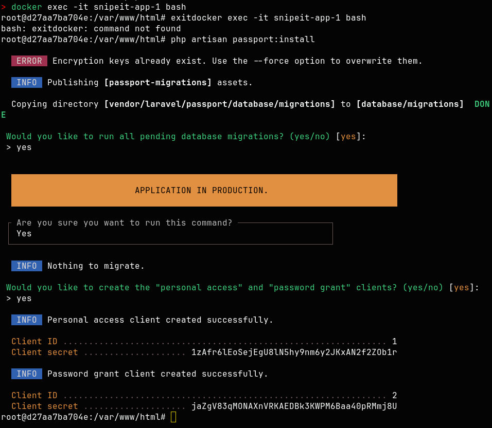

# API

Create API key using UI. If you encounter an error do as follows

documentation --> https://snipe-it.readme.io/reference/generating-api-tokens

To fetch details use this 

~~~
curl -X GET http://localhost:8000/api/v1/components/25 \
  -H "Authorization: Bearer YOUR_API_KEY" \
  -H "Accept: application/json" \
  -H "Content-Type: application/json"

~~~

You will get this 

~~~
{"id":25,"name":"Raspberry Pi 4 model B 8gb","image":null,"serial":null,"location":{"id":1,"name":"AIOT garage","tag_color":null},"qty":4,"min_amt":null,"category":{"id":12,"name":"Single Board Computer","tag_color":null},"supplier":null,"manufacturer":{"id":5,"name":"Raspberry Pi Foundation","tag_color":null},"model_number":null,"order_number":"","purchase_date":null,"purchase_cost":null,"total_cost":null,"remaining":4,"company":null,"notes":null,"created_by":{"id":1,"name":"Mark Fernando"},"created_at":{"datetime":"2026-03-15 18:46:01","formatted":"2026-03-15 06:46 PM"},"updated_at":{"datetime":"2026-03-15 18:46:01","formatted":"2026-03-15 06:46 PM"},"user_can_checkout":1,"available_actions":{"checkout":true,"checkin":true,"update":true,"delete":true}}%

~~~

Using API keys, it is possible to create an automated system. For example, if the stock of a certain component is running low, we can set up an alert. This alert could be sent via email or a Microsoft Teams notification, through Home Assistant.

Since data can be retrieved through the API, many automated actions can be created.

[back to features](features.md)