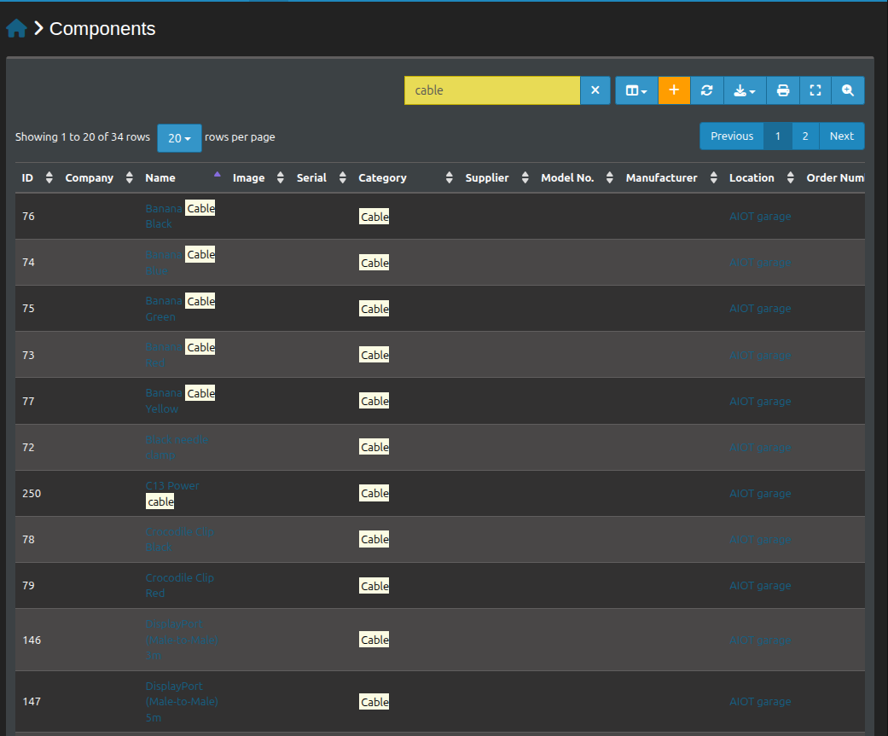
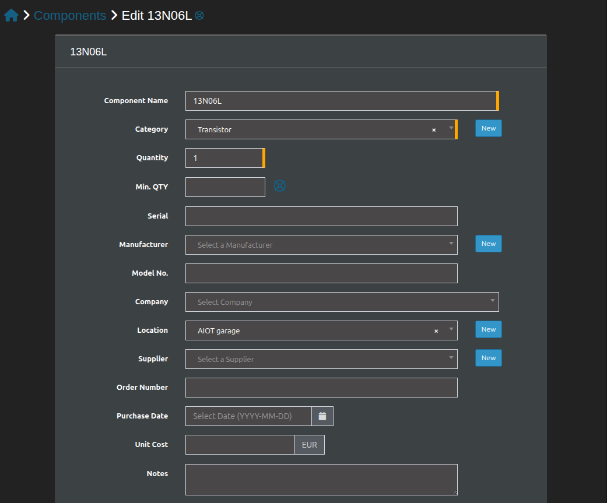
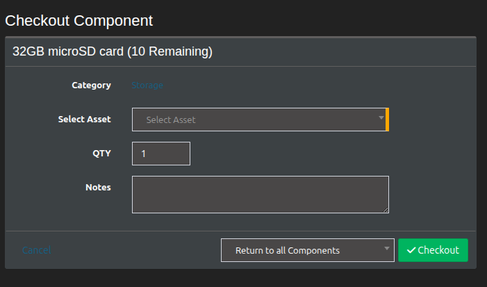

# Features

- Able to search

- Filtering inventory: Items can be filtered such as manufactor, location, availble qty and so on

- Able to edit after import

- Able to checkout items

- Quantity tracking: After checkout system track the available qty

- Able to create new item(components/assets...)

- API. Find more details [here](api.md)

- email alerts. try --> https://snipe-it.readme.io/docs/email-alerts

