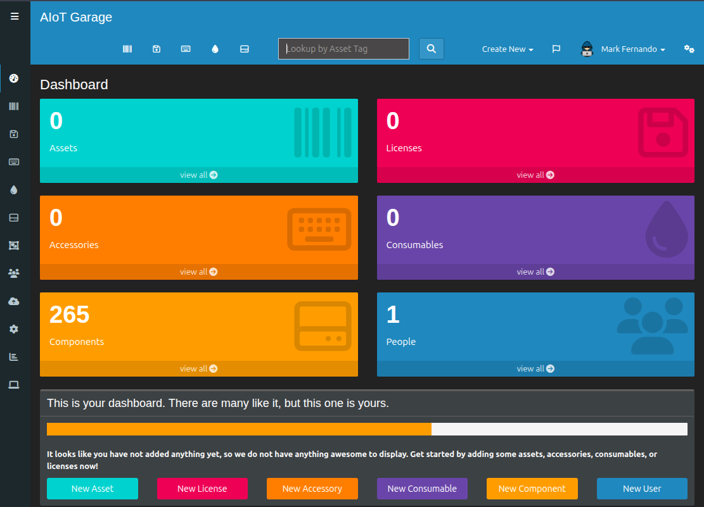
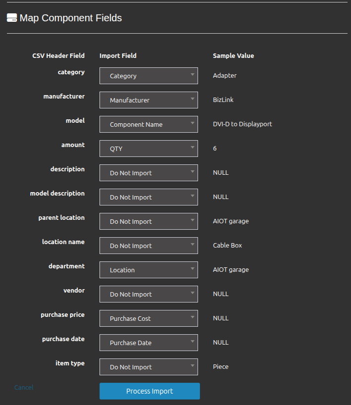

# Things to remember

- A single csv file cannot be used to import multiple types in Snipe-IT. For an example when importing csv we have to select what we going to import. if components  is selected as the import type, all entries in the csv will be treated as components. So if we have multiple types such as assets, accessories, components then we have to split in to seperate csv files. Each csv should comtanin only one item type.

- When importing a CSV file into Snipe-IT, the data must match the fields that are already defined in the system. Although Snipe-It supports custom fields, those should create before performing the import and it only available for assets

As you can see I add csv as components and I couldnt find matching field

- During CSV import, empty date fields represented as "NULL" were interpreted as (1970-01-01). To avoid incorrect dates, empty date fields should be left blank. 

[⬅️ Back to Home](../README.md)